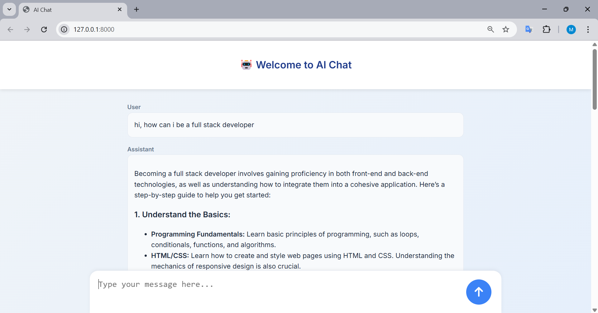

# SAM1.0

---

```markdown
# 🤖 AI Chat Web App

An interactive web-based AI chat interface built with **Django** on the backend and **JavaScript** on the frontend. This application allows users to interact with an AI assistant through a sleek, modern UI.

---

## 📸 Demo

 <!-- Replace or remove this line if no image -->

---

## 🚀 Features

- Real-time chat interface with smooth message rendering
- Asynchronous communication with the backend using `fetch()`
- Messages styled and grouped by role: User and Assistant
- Scrolls automatically to the newest messages
- Timestamped messages (using `auto_now_add`)
- Responsive and mobile-friendly layout
- FontAwesome icons for better visual experience

---

## 🛠️ Tech Stack

- **Backend**: Django (Python)
- **Frontend**: HTML, CSS (with Inter font and custom styles), JavaScript
- **Icons**: Font Awesome
- **Database**: SQLite (default for Django)
- **Deployment**: Localhost (127.0.0.1)

---

## 📂 Project Structure

```
<pre lang="markdown"><code> chatproject/ │ ├── chatapp/ │ ├── migrations/ │ ├── templates/ │ │ └── chatapp/ │ │ └── index.html │ ├── static/ │ │ ├── css/ │ │ │ └── style.css │ │ └── js/ │ │ └── script.js │ ├── models.py │ ├── views.py │ └── urls.py │ ├── chatproject/ │ ├── __init__.py │ ├── settings.py │ ├── urls.py │ └── wsgi.py │ ├── db.sqlite3 └── manage.py </code></pre>
```

---

## 📦 Installation

1. **Clone the repository**:
   ```bash
   git clone https://github.com/yourusername/ai-chat-web.git
   cd ai-chat-web
   ```

2. **Set up a virtual environment**:
   ```bash
   python -m venv venv
   source venv/bin/activate  # On Windows use `venv\Scripts\activate`
   ```

3. **Install dependencies**:
   ```bash
   pip install -r requirements.txt
   ```

4. **Apply migrations**:
   ```bash
   python manage.py migrate
   ```

5. **Run the development server**:
   ```bash
   python manage.py runserver
   ```

6. **Open in your browser**:
   ```
   http://127.0.0.1:8000/
   ```

---

## 🧠 How it Works

- The user types a message into the chat box.
- JavaScript captures the input and sends it via a `POST` request to the `/chat` endpoint.
- The backend receives the message, generates a response (placeholder or AI-powered), and returns it.
- The frontend appends both messages (user and assistant) dynamically to the chat container.

---

## ✅ To Do

- Integrate with OpenAI or other NLP API for actual AI responses
- Add login/authentication
- Support chat history
- Enable Markdown formatting in responses
- Add typing indicator or loader animation

---

## 📄 License

This project is open-source and available under the [MIT License](LICENSE).

---

## 🙌 Acknowledgments

- [Django](https://www.djangoproject.com/)
- [Font Awesome](https://fontawesome.com/)
- [Google Fonts – Inter](https://fonts.google.com/specimen/Inter)
